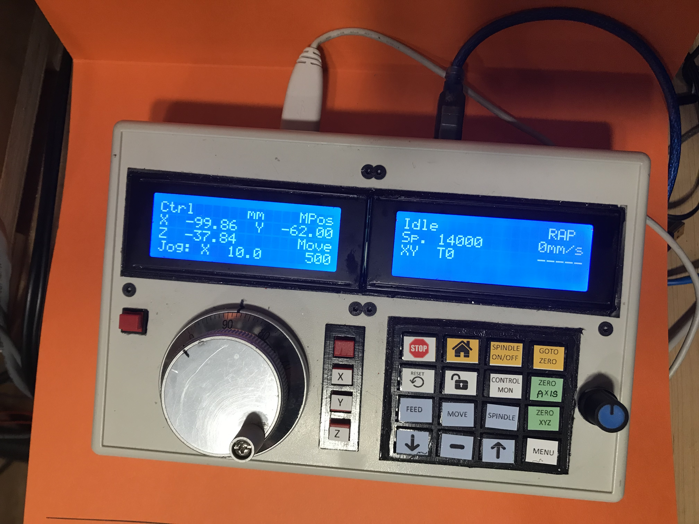
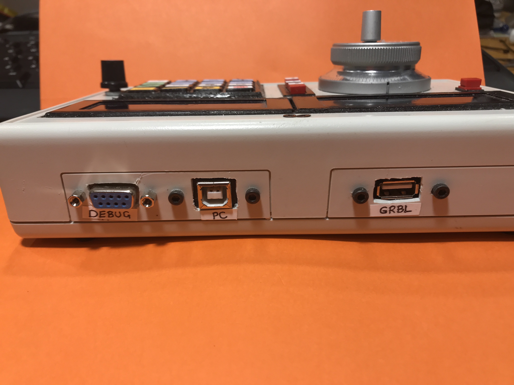

# GRBL Pendant

This project is a pendant for a GRBL CNC controller. It can act standalone, requiring connections only to the GRBL controller and to power, or can sit between a PC running a gcode sender application such as UGS and the GRBL controller. 

In the standalone configuration it can work in "control mode" to home the system, jog along a selected axis, and perform various reset, unlock, and zero axis operations.  

If running attached to a PC running a gcode sender, it can work in "monitor mode" where it listens to the traffic from the GRBL controller and displays X/Y/Z position, status, alarms, etc. This is the mode to use if the gcode sender is streaming commands. It can also be switched into control mode to send commands directly. All traffic from the  sender is intercepted and retransmitted to the controller so in principle it should be able to seamlessly inject commands into the stream from the sender but more work is required to ensure that the controller's communication buffer is handled properly.

Main control is via a "6 Terminal CNC Pulse Encoder" that can be switched to the X, Y, or Z axis. Distance for one revolution and feed rate can be modified by selecting the "move" or "feed" buttons then using the up and down arrows.

A second encoder with integral push button is provided for a menu system to configure the system, but this is not currently operational.

This version runs on a Teensy 4.1 which allows it to act as a USB host to drive the controller, in addition to acting as a USB device for the connection to a PC. An earlier version used a UART for communication to the controller and worked with a Teensy 3.2.

It uses standard hardware available from all the usual sources. The main components are:
1. Teensy 4.1 https://www.pjrc.com/store/teensy41.html
2. Qty 2 20x4 LCD displays using I2C connections  (set to addressed 0x26 and 0x27) like this https://www.amazon.com/GeeekPi-Interface-Adapter-Backlight-Raspberry/dp/B086VVT4NH
3. One jog wheel encoder like this https://www.amazon.com/dp/B07G9G9VYC
4. Rotary encoder for menu system https://www.amazon.ca/Encoder-Development-Rotating-Potentiometer-Arduino/dp/B07H4L1N84
5. USB Type B panel mount to micro USB https://www.amazon.ca/Traovien-Printer-MacBook-Samsung-Printers/dp/B09FGPJNXN
6. USB Type A penel mount motherboard cable. Buy something like this and use only 1/2 of it. https://www.aliexpress.com/item/1005001419024926.html
7. 4x4 keypad https://www.amazon.ca/SunFounder-Matrix-Keypad-Arduino-Raspberry/dp/B015E32IXY

Twenty buttons in a 4x5 scanned matrix array are used for most control funtions. The 4x4 keypad to the right is a purchased array of microswitches to which I added 3D printed key caps and frame. The four in the left most row used for axis control and jog cancel were added later, and room was tight, so slightly smaller individual switches were used. The last four switches, as well as the one to the top left of the jog wheel, are 10mm x 10mm pushbuttons from my local electronics store. Starting over, a 4x5 array of identical switches would be nicer.  

